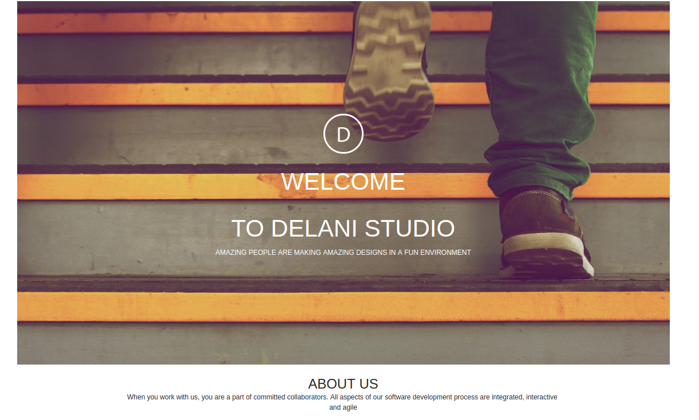

# DELANI STUDIO

## Description

This is a landing page for a fictional studio, ***Delani Studio***.

## Author
Frankline Baraka Mulama

## Project's Screenshot

## Link to the Source
https://github.com/barakamulas/delani-studio

## Live link to the webpage

https://barakamulas.github.io/delani-studio

## Technologies Used

* HTML
* CSS
* Bootstrap
* Javascript
* Jquery

## How to setup

### First Method

1. In the terminal navigate to the directory you want the project to reside in e.g (cd ~/Documents)
1. Clone the project (git clone https://github.com/barakamulas/delani-studio )
1. Navigate into the created folder (cd akan-names)
1. Open the project with a text editor eg atom (atom .)

### Second Method
1. Download the project's zip files
1. Extract it to a  folder  of your choice
1. In a text editor open the project's folder
